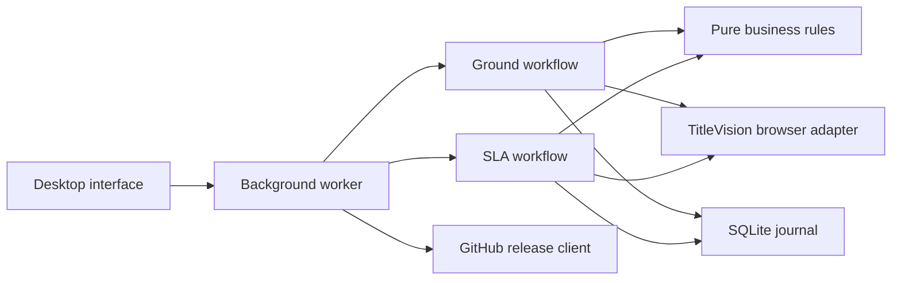

# TitleVision Assistant

### Review first. Update precisely. Keep a record.

[](https://github.com/mayanknandgowle/titlevision-assistant/actions/workflows/checks.yml)
[](docs/USER_GUIDE.md)
[](docs/DEVELOPMENT.md)
[](LICENSE)

A local Windows desktop assistant for reviewing and updating TitleVision ETA reminders. It combines business rules, a visible browser session, and a local audit trail so operators can inspect proposed changes before committing them.

**Release status:** supervised validation. Automated tests use synthetic data; an approved live SLA edit and authentication restart test are still required before broad operational use. This is an independent project, not an official DataTrace product.

[Download releases](https://github.com/mayanknandgowle/titlevision-assistant/releases) · [User guide](docs/USER_GUIDE.md) · [Architecture](docs/ARCHITECTURE.md) · [Release process](docs/RELEASING.md) · [Security](SECURITY.md)

## Two workflows, one review process

| Workflow | What it does | Operator control |
| --- | --- | --- |
| Ground orders | Finds blank ETA comments and proposes the product SLA date at 5 PM Eastern | Existing ETA comments are preserved |
| Resolve expired SLA | Reads Active/Available tasks, matches the active product and edits its existing ETA | Requires confirmation of the actual delay reason |

For SLA recovery, the revised ETA is **five weekdays after the previous ETA, at 5 PM Eastern**. Weekends are excluded; holidays are not. Missing ETAs can use the expired product SLA as the base when the queue comment is also blank. Future ETAs and dates still in the past are held for review.

State/client templates and twenty supported delay categories guide wording. A suggestion does not establish facts: the operator must verify the reason against the order.

## Designed around controlled changes

- **Read-only preview:** see proposed deadlines and comments before updating.
- **Revalidation:** check the account, product, SLA and reminder again before saving.
- **Safe failure:** unreadable reminder rows and failed refreshes block changes.
- **One recorded attempt:** reserve the operation before submission; uncertain saves stop the run and are not automatically retried.
- **History that survives upgrades:** local SQLite journal in a stable user-data folder; import history from earlier app copies and export CSV.
- **Dedicated browser profile:** retains browser data without collecting passwords; DataTrace can still expire authentication.
- **GitHub updates:** the ↻ button checks published stable releases, downloads an installer and verifies its SHA-256. Automatic installer launch additionally requires matching trusted publisher signatures.

## Get started

1. Download the Windows installer from **Releases**. Keep the portable app's `_internal` folder alongside its executable if using the ZIP instead.
2. Open the app. When upgrading from an older copy, use **Import previous history** to select its `data/history.sqlite3` before updating orders.
3. Open the TitleVision browser and sign in directly on the site's page.
4. Choose a workflow, preview orders and review the proposed changes.
5. For SLA recovery, confirm each factual delay reason. **Run updates** applies all Ready rows.

**Try demo** shows synthetic Ground orders and cannot submit them. **Stop** prevents the next submission; an in-flight save is verified first.

## Architecture at a glance



Business rules are independent of the browser and interface. Tests replace live pages with synthetic fixtures. The updater uses GitHub's public release API and never needs a token embedded in the distributed app.

## Development

On Windows x64 with Python 3.13 and Microsoft Edge:

```powershell
py -3.13 -m venv .venv
.\.venv\Scripts\python.exe -m pip install --require-hashes -r requirements-build.lock
.\.venv\Scripts\python.exe -m unittest discover -s tests -v
.\.venv\Scripts\python.exe source\app.py --demo
```

See [development](docs/DEVELOPMENT.md) for builds and [validation](VALIDATION.md) for test scope. GitHub Actions tests pull requests and builds reviewable draft releases from version tags.

## Boundaries

- Automation follows the observed TitleVision page layout; site changes may require an adapter update.
- Updating an ETA does not change the contractual SLA or guarantee the red indicator disappears.
- Holiday calendars and additional county-specific mappings require approved business rules.
- There is no unattended scheduling or automatic retry of uncertain saves.
- The first unsigned release requires manual installation. A signed release chain is needed for automatic installation.
- No real orders, customer screenshots, browser profiles, credentials or history databases belong in this repository.

## License

**All rights reserved.** Public visibility is provided for review and collaboration; this project is not offered under an open-source license. See [LICENSE](LICENSE). Third-party components retain their own licenses; see [notices](THIRD_PARTY_NOTICES.md).
